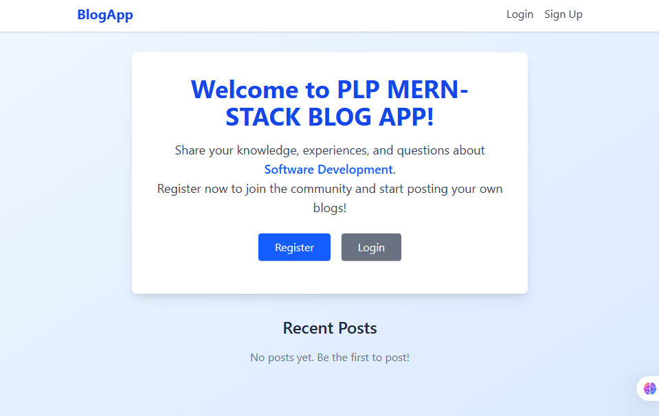
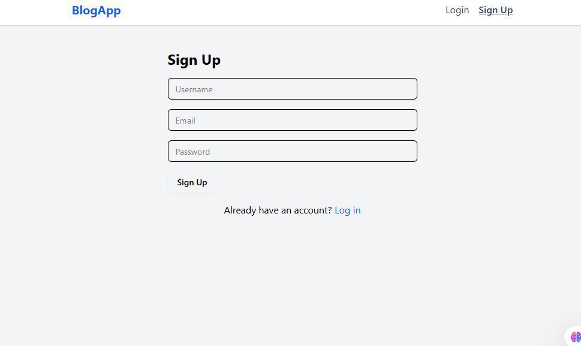
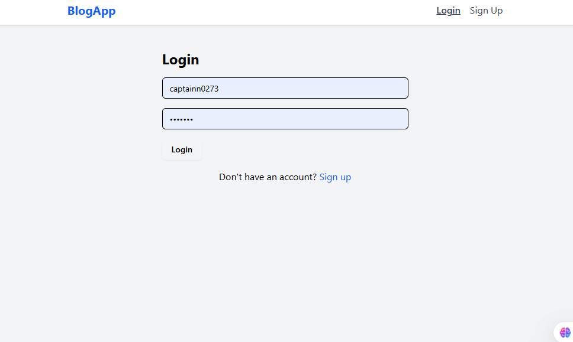
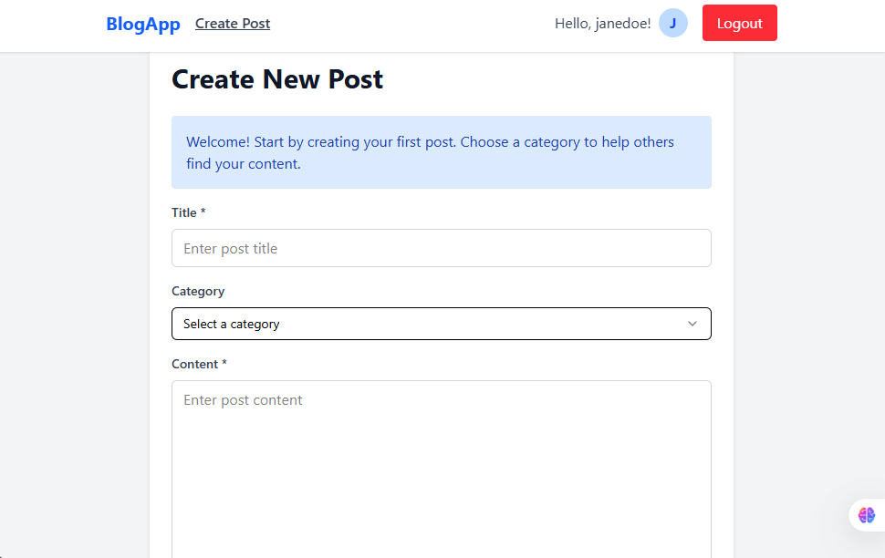

[](https://classroom.github.com/online_ide?assignment_repo_id=19895120&assignment_repo_type=AssignmentRepo)
# MERN Blog App

A full-stack blog application built with the MERN stack (MongoDB, Express, React, Node.js). Users can register, log in, create categorized posts, and view posts from other members. Includes authentication, real-time updates, and a modern UI/UX.

---

## Features
- User registration and login with JWT authentication
- Create, edit, and delete blog posts
- Categorize posts for easy discovery
- View all posts or filter by category
- Responsive, modern UI with a sticky navbar
- Real-time updates with Socket.io
- Protected routes for authenticated actions
- Error handling and user feedback with toasts

---

## Tech Stack
- **Frontend:** React, Vite, Tailwind CSS, Axios, React Router
- **Backend:** Node.js, Express, MongoDB, Mongoose, JWT, Socket.io

---

## Getting Started

### Prerequisites
- Node.js (v16+ recommended)
- MongoDB (local or Atlas)
- pnpm (or npm/yarn)

### 1. Clone the Repository
```bash
git clone <your-repo-url>
cd week-4-mern-integration-assignment-snjugunanjenga
```

### 2. Setup the Backend
```bash
cd server
cp .env.example .env # Edit .env with your MongoDB URI and JWT secret
pnpm install # or npm install
pnpm run dev # or npm run dev
```

### 3. Setup the Frontend
```bash
cd ../client
cp .env.example .env # Create and set VITE_API_URL (see below)
pnpm install # or npm install
pnpm run dev # or npm run dev
```

#### Example `client/.env`:
```
VITE_API_URL=http://localhost:5000
```

#### Example `server/.env`:
```
MONGO_URI=mongodb://localhost:27017/mern-blog
JWT_SECRET=your_jwt_secret
```

---

## Usage
- Register a new account or log in.
- After login, first-time users are guided to create their first post.
- Create posts and assign them to categories.
- Browse posts from all users, filter by category, and interact.
- Log out securely from the navbar.

---

## Development
- **Frontend:** Located in `/client` (Vite + React)
- **Backend:** Located in `/server` (Express + MongoDB)
- API endpoints are prefixed with `/api` (e.g., `/api/posts`, `/api/auth`)
- Real-time events are handled via Socket.io

---

## Scripts
### Backend
- `pnpm run dev` — Start backend with nodemon
- `pnpm start` — Start backend in production mode

### Frontend
- `pnpm run dev` — Start frontend dev server
- `pnpm build` — Build frontend for production
- `pnpm preview` — Preview production build

---

## Screenshots

Here are some screenshots of the application in action:

### Home Page


### Signup Page


### Login Page


### Create New Post


---

## License
MIT

---

## Contributors
- [Cpt. N](https://github.com/snjugunanjenga)
- [Stechie-tech](https://github.com/stechie-tech)

## Project Structure

```
mern-blog/
├── client/                 # React front-end
│   ├── public/             # Static files
│   │   ├── components/     # Reusable components
│   │   ├── pages/          # Page components
│   │   ├── hooks/          # Custom React hooks
│   │   ├── services/       # API services
│   │   ├── context/        # React context providers
│   │   └── App.jsx         # Main application component
│   └── package.json        # Client dependencies
├── server/                 # Express.js back-end
│   ├── config/             # Configuration files
│   ├── controllers/        # Route controllers
│   ├── models/             # Mongoose models
│   ├── routes/             # API routes
│   ├── middleware/         # Custom middleware
│   ├── utils/              # Utility functions
│   ├── server.js           # Main server file
│   └── package.json        # Server dependencies
└── README.md               # Project documentation
```

## Files Included

- `Week4-Assignment.md`: Detailed assignment instructions
- Starter code for both client and server:
  - Basic project structure
  - Configuration files
  - Sample models and components

## Requirements

- Node.js (v18 or higher)
- MongoDB (local installation or Atlas account)
- npm or yarn
- Git

## Submission

Your work will be automatically submitted when you push to your GitHub Classroom repository. Make sure to:

1. Complete both the client and server portions of the application
2. Implement all required API endpoints
3. Create the necessary React components and hooks
4. Document your API and setup process in the README.md
5. Include screenshots of your working application

## Resources

- [MongoDB Documentation](https://docs.mongodb.com/)
- [Express.js Documentation](https://expressjs.com/)
- [React Documentation](https://react.dev/)
- [Node.js Documentation](https://nodejs.org/en/docs/)
- [Mongoose Documentation](https://mongoosejs.com/docs/) 